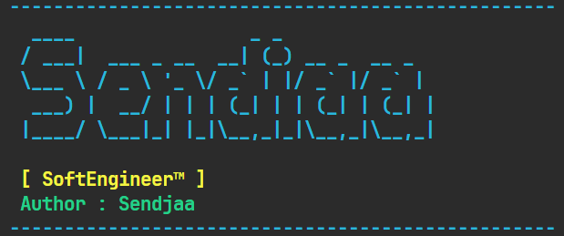

# 🛒 SoftEngineer™ Flashsale Bot
... (badges) ...




An automated high-performance Shopee Flash Sale bot built with **Python** and **Playwright**. Designed for speed, reliability, and ease of use through a dedicated terminal interface.

---

## 🚀 Features
* **Remote Debugging**: Connects to your existing Chrome session to bypass login & OTP issues.
* **Millisecond Precision**: High-frequency time sync for exact "00" second execution.
* **Brute-Force Execution**: Parallel logic to handle product pages and checkout transitions simultaneously.
* **Modular Config**: Separated `config.json` for easy targeting without touching the source code.
* **Interactive CLI**: Professional terminal UI with an integrated menu system.

---

## 📂 Project Structure
text
    flashsale-bot/
    ├── config.json       # User configurations (URL, Target Time, Delays)
    ├── user_data_bot/  <-- (Folder ini akan terisi otomatis oleh Chrome)
    ├── utils.py          # UI Components, ASCII Banner, and Config Loader
    ├── testing.py        # Main Engine & Automation Logic
    └── README.md         # Documentation

---
## 🛠️ Prerequisites
- **Python 3.8+**
- **Google Chrome**
- **Playwright Library**

---

## 📥 Installation

1. **Clone the repository:**
   ```bash
   git clone [https://github.com/yourusername/softengineer-bot.git](https://github.com/yourusername/softengineer-bot.git)
   cd softengineer-bot

2. **Install depedencies**
- pip install playwright
- playwright install chromium

## ⚙️ Configuration
Open config.json and update your target settings:

{
    "URL_PRODUCT": "[https://shopee.co.id/target-product-link](https://shopee.co.id/target-product-link)",
    "WAKTU_WAR": "2026-03-30 00:00:00",
    "RELOAD_DELAY": 0.5,
    "CLICK_DELAY": 250
}

## 🔌 Setup (Crucial Step)
To bypass bot detection, you must run Chrome in Remote Debugging mode before starting the bot:

* **1. Close all Chrome windows.**
* **2. Open CMD and run:**
    "C:\Program Files\Google\Chrome\Application\chrome.exe" --remote-debugging-port=9222 --user-data-dir="C:\Users\YourUser\Documents\chrome_session"
* **3. Login to Shopee in the new Chrome window and stay on the product page.**

## 🏃 Usage
Run the main script from your terminal:

    ```Bash
    python testing.py
    ```
    Select Option [1] to start the standby mode.

##🛡️ Disclaimer
This project is for educational purposes only. Using automation scripts on e-commerce platforms may violate their Terms of Service and could lead to account suspension. Use at your own risk.

Author
Muhammad Alfito (Sendjaa) Informatics Student @ UNJANI LinkedIn | Portfolio


---

### Tips for your Portfolio:
* **Screenshots**: Once you have the bot running with the new ASCII banner, take a screenshot of your terminal and add it to the README under the "Features" section.
* **License**: If you want to make it open-source, consider adding an **MIT License** file.
* **GitHub Actions**: Since you are an Informatics student, mentioning that you use `Playwright` for "End-to-End Testing logic applied to automation" sounds very impressive to tech recruiters.

Would you like me to help you draft the **LinkedIn post** to showcase this project?
